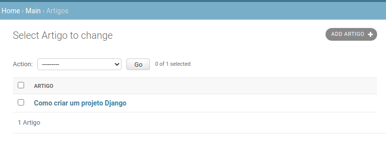

**[<< Voltar](./readme.md)**


<div style="margin: 20px 0 20px 0;"><a href="./pdf/django-14-cheatsheet.pdf" target="_blank" > >>DOWNLOAD DJANGO CHEATSHEET<< </a> </div>


- [1 - Dependências](#1---dependências)
  - [1.1 - Instalar PIP](#11---instalar-pip)
  - [1.2 - Instalar o virtualenv](#12---instalar-o-virtualenv)
- [2 - Novo projeto](#2---novo-projeto)
  - [2.1 - Criar o diretório do novo projeto](#21---criar-o-diretório-do-novo-projeto)
  - [2.2 - Criar o diretório de dependências do projeto](#22---criar-o-diretório-de-dependências-do-projeto)
  - [2.3 - Carregar as variáveis venv](#23---carregar-as-variáveis-venv)
  - [2.4 - Desativar as variáveis venv](#24---desativar-as-variáveis-venv)
  - [2.5 - Criar a estrutura do projeto](#25---criar-a-estrutura-do-projeto)
  - [2.6 - Criar primeiro app módulo](#26---criar-primeiro-app-módulo)
  - [2.7 - Habilitar um novo módulo app ou lib](#27---habilitar-um-novo-módulo-app-ou-lib)
  - [2.8 - Fazer a primeira migração](#28---fazer-a-primeira-migração)
- [3 - Executar projeto](#3---executar-projeto)
- [4 - Instalar pacotes](#4---instalar-pacotes)
- [5 - Model](#5---model)
  - [5.1 - Criar ou Editar uma model](#51---criar-ou-editar-uma-model)
  - [5.2 - Alterar o nome da entitade no Django Admin](#52---alterar-o-nome-da-entitade-no-django-admin)
  - [5.3 - Especificar o nome verboso do model no Django admin](#53---especificar-o-nome-verboso-do-model-no-django-admin)
  - [5.4 - Exclusão lógica](#54---exclusão-lógica)
- [6 - Migração de banco de dados](#6---migração-de-banco-de-dados)
- [7 - Habilitar uma model na administração do Django](#7---habilitar-uma-model-na-administração-do-django)
- [8 - Customização do Admin - Configuração](#8---customização-do-admin---configuração)
  - [8.1 - Alterar informações básicas](#81---alterar-informações-básicas)
  - [8.2 - Customização dos Apps Módulos - Configuração](#82---customização-dos-apps-módulos---configuração)
  - [8.3 - Customização geral da aplicação - Configuração](#83---customização-geral-da-aplicação---configuração)
    - [8.3.1 - Tradução geral do projeto](#831---tradução-geral-do-projeto)
    - [8.3.2 - Timezone](#832---timezone)
- [9 - Upload de arquivos](#9---upload-de-arquivos)
- [10 - Upload de imagens](#10---upload-de-imagens)
- [11 - CKEDITOR](#11---ckeditor)
- [12 - Autenticação e Controle de usuários](#12---autenticação-e-controle-de-usuários)
  - [12.1 - Criar um usuário administrador](#121---criar-um-usuário-administrador)
  - [12.2 - Autenticação keycloak](#122---autenticação-keycloak)
- [13 - Django Rest Framework](#13---django-rest-framework)
  - [13.1 - Instalando o Django Rest Framework (DRF)](#131---instalando-o-django-rest-framework-drf)
  - [13.2 - Estrutura e configuração inicial API Rest](#132---estrutura-e-configuração-inicial-api-rest)
  - [13.3 - Configurações gerais Rest Framework](#133---configurações-gerais-rest-framework)
    - [13.3.1 - Configurações de autenticação](#1331---configurações-de-autenticação)
    - [13.3.2 - Configurações de permissão de acesso](#1332---configurações-de-permissão-de-acesso)
  - [13.4 - Demostração das rotas API](#134---demostração-das-rotas-api)
  - [13.5 - Serialização](#135---serialização)
    - [13.5.1 - Estrutura da serialização](#1351---estrutura-da-serialização)
    - [13.5.2 - Serializando entidades filhas/subordinadas](#1352---serializando-entidades-filhassubordinadas)
  - [13.6 - Viewsets](#136---viewsets)


# 1 - Dependências

## 1.1 - Instalar PIP
Caso não tenha o gerenciador de pacotes **PIP** instalar seguindo o seguinte comando:

```sh
apt-get install python-pip
```

## 1.2 - Instalar o virtualenv
O python costuma colocar as variáve em um diretorio local geral o que pode gerar muito problema de versionamento/compatibilidade.

Para evitar problemas de compatibilidade entre projetos o ideal é utilizar o **virtualenv**.

```sh
pip install virtualenv

```
# 2 - Novo projeto


## 2.1 - Criar o diretório do novo projeto

```sh
mkdir <NOME DO PROJETO SEM "-" ou "_">
```

```sh
cd <NOME DO PROJETO>
```

## 2.2 - Criar o diretório de dependências do projeto

```sh
# estrutura do comando: virtualenv <NOME DO VENV DIR>
virtualenv .venv
```
ou

```sh
# estrutura do comando: python3 -m venv <NOME DO VENV DIR>
python3 -m venv .venv
```

## 2.3 - Carregar as variáveis venv

```sh
# estrutura do comando: source <NOME VENV DIR>/bin/activate
source .venv/bin/activate
```

## 2.4 - Desativar as variáveis venv

```sh
deactivate
```

## 2.5 - Criar a estrutura do projeto

```sh
# estrutura do comando: django-admin startproject <PROJECT> .
django-admin startproject meuprimeiroprojeto .
```
> Foi colocado o ponto no final do comando porque o comando está sendo executado dentro do proprio diretorio do projeto. Caso o comando seja executado sem o "." no final, será criado um novo diretório com o mesmo nome do projeto.


## 2.6 - Criar primeiro app módulo

```sh
# estrutura do comando: django-admin startapp <APP>
django-admin startapp main
```

## 2.7 - Habilitar um novo módulo app ou lib

Editar o arquivo **settings.py** conforme exemplo a seguir:

```python
INSTALLED_APPS = [
    'django.contrib.admin',
    'django.contrib.auth',
    'mozilla_django_oidc',
    'django.contrib.contenttypes',
    'django.contrib.sessions',
    'django.contrib.messages',
    'django.contrib.staticfiles',
    'main', # adicionar aqui o novo app
    'rest_framework', # exemplo de uma nova lib adicinada
]
```


## 2.8 - Fazer a primeira migração

Antes de inicializar um novo projeto é aconselhado fazer um migration para que todas as funcionalidades funcionem de forma adequada. 

```sh
python manage.py migrate
```

# 3 - Executar projeto

```sh
python manage.py runserver
```

ou

```sh
python manage.py runserver 0.0.0.0:9000
```

Acessar aplicação pelo endereço: http://localhost:8000
<div></div>

# 4 - Instalar pacotes

| Descrição                                  | Comando                         |
|--------------------------------------------|---------------------------------|
| Instalar pacotes **sem** versão expecifica | pip install requests            |
| Instalar pacotes **com** versão expecifica | pip install requests==0.6.2     |
| Instalar lista de pacotes de um arquivo    | pip install -r requirements.txt |


Exemplo de **requirements.txt**:

```txt
asgiref==3.4.1
Django==3.2.10
django-picklefield==3.0.1
django-rest-framework==0.1.0
djangorestframework==3.12.4
jsonfield==3.1.0
pytz==2021.3
sqlparse==0.4.2
typing-extensions==3.10.0.2
mozilla_django_oidc
python-keycloak
django-rest-framework-keycloak
```

# 5 - Model

Para criar uma nova model ou fazer qualquer atualização é necessário seguir os passos a seguir:


## 5.1 - Criar ou Editar uma model

É necessário editar o arquivo *model.py* que está localizado na seguinte extrutura de diretório

```sh
\project
    \post
        \migrations
        __init__.py
        admin.py
        apps.py
        models.py #editar este arquivo 
        tests.py
        views.py
```

Exemplo de entidade no arquivo *model.py*

```python
from django.contrib.auth.models import User
from django.utils import timezone
from django.db import models


class Post(models.Model):
    title = models.CharField('Título',max_length=255)
    slug = models.SlugField(max_length=255, unique=True)
    author = models.ForeignKey(User, on_delete=models.CASCADE )
    body = models.TextField()
    created_at = models.DateTimeField(auto_now_add=True)
    updated_at = models.DateTimeField(auto_now=True)
    deleted_at = models.DateTimeField(blank=True, null=True)
    def __str__(self):
        return self.title
    class Meta:
        verbose_name = "Artigo"
        verbose_name_plural = "Artigos"


```

Elementos da entidade

| Tipo de campo     | Elemento      | Ex. Atributo      | Exemplo                                                     |
|-------------------|---------------|-------------------|-------------------------------------------------------------|
| Texto curto       | CharField     | max_length=255    | title = models.CharField('Título',max_length=255)           |
| Slug              | SlugField     | max_length=255    | slug = models.SlugField(max_length=255, unique=True)        |
| Texto longo       | TextField     | unique=True       | body = models.TextField()                                   |
| Data e hora       | DateTimeField | auto_now_add=True | created_at = models.DateTimeField(auto_now_add=True)        |
| Upload arquivo    | FileField     | upload_to=''      | file = models.FileField(upload_to='files/%Y/%m/%d')         |
| Chave estrangeira | ForeignKey    | on_delete         | author = models.ForeignKey(User, on_delete=models.CASCADE ) |

Ao finalizar as alterações na entidade é necessario criar um migração e executar para que seja aplicada as modificações no banco

```sh
python manage.py makemigrations
```

```sh
python manage.py migrate
```

> Para mais detalhes o capitulo sobre migrações

## 5.2 - Alterar o nome da entitade no Django Admin

No Django Admin, quando não se especifica os campos de exibição na listagem do modelo ele é exibido com um objeto, conforme a imagem a seguir:

<div></div>

para solucionar esse problema o procedimento é simples, basta colocar na model a seguinte especificação:

```python
    def __str__(self):
        return self.title 
```
Exemplo completo:

```python
from django.db import models
# Create your models here.
class Post(models.Model):
    
    title = models.CharField('Título',max_length=255)
    ...

    def __str__(self):
        return self.title 

```

Resultado:

<div></div>


## 5.3 - Especificar o nome verboso do model no Django admin

Na model com uma classe Meta é possivel expecificar o nome (singular e plural) de exibição do Módulo/App conforme exemplo a seguir:

 ```python
    class Meta:
        verbose_name = "Artigo"
        verbose_name_plural = "Artigos"
```

Exemplo completo:

```python
from django.contrib.auth.models import User
from django.utils import timezone
from django.db import models

class Post(models.Model):
    
    title = models.CharField('Título',max_length=255)
    ...
    class Meta:
        verbose_name = "Artigo"
        verbose_name_plural = "Artigos"


```

## 5.4 - Exclusão lógica

para fazer a exclusão lógica na classe model é necessário fazer os seguintes ajustes:


importar o QuerySet:

```python
from django.db.models.query import QuerySet
```

Adicionar as classes

```python
class SoftDeletionQuerySet(QuerySet):
    def delete(self):
        return super(SoftDeletionQuerySet, self).update(deleted_at=timezone.now())

    def hard_delete(self):
        return super(SoftDeletionQuerySet, self).delete()
    def alive(self):
        return self.filter(deleted_at=None)
    def dead(self):
        return self.exclude(deleted_at=None)

class SoftDeletionManager(models.Manager):
    def __init__(self, *args, **kwargs):
        self.alive_only = kwargs.pop('alive_only', True)
        super(SoftDeletionManager, self).__init__(*args, **kwargs)

    def get_queryset(self):
        if self.alive_only:
            return SoftDeletionQuerySet(self.model).filter(deleted_at=None)
        return SoftDeletionQuerySet(self.model)

    def hard_delete(self):
        return self.get_queryset().hard_delete()
```

Adicionar na classe da entidade os seguintes atributos e metodo:

```python

class Post(models.Model):
    deleted_at = models.DateTimeField(blank=True, null=True) #1
    objects = SoftDeletionManager() #2
    all_objects = SoftDeletionManager(alive_only=False) #3
    
    ...

    def delete(self): #4
        self.deleted_at = timezone.now()
        self.save()       

```

# 6 - Migração de banco de dados

O Django utiliza uma estrutura de migração, ao gerar uma nova migração de banco de dados, será gerado a seguinte estrutura:

```sh
\project
    \post
        \migrations # Diretório de migração
            __pycache__
            __init__
            0001_initial.py # Arquivos de migração
            0002_rename_user_post_author.py # Arquivos de migração
        __init__.py
        admin.py
        apps.py
        models.py 
        tests.py
        views.py
```

Lista dos principais comandos

| Comando                                    | Descrição                                     |
|--------------------------------------------|-----------------------------------------------|
| **python manage.py makemigrations**        | Gera uma nova migração de todo o projeto      |
| **python manage.py makemigrations post**   | Gera uma nova migração do app especifico      |
| **python manage.py migrate**               | Executa uma migração de todo o projeto        |
| **python manage.py migrate post**          | Executa uma migração do app especifico        |
| **python manage.py migrate post <versão>** | Executa uma migração de uma versão especifica |
| **python manage.py migrate post zero**     | Zera todas as migrações de um app específico  |
| **python manage.py showmigrations**        | Lista todas migração de todo o projeto        |
| **python manage.py showmigrations post**   | Lista todas migração do app especifico        |


# 7 - Habilitar uma model na administração do Django


O primeiro é editar o arquivo **admin.py** conforme a estrutura a seguir:  

```sh
\project
    \post
        \migrations 
        __init__.py
        admin.py  # editar este arquivo 
        apps.py
        models.py 
        tests.py
        views.py
```

Existem duas formas de trabalhar com a implementação do módulo no admin:

**Básica**: que seria em apensas habilitar o módulo. 

```python
# Primeiro importa a Classe
from .models import Post


admin.site.register(Post)
```

**Avançada**: que abre mais possibilidades de customizações como filtros, campos de exibição, ordenação de campos e etc.. 


```python
# Primeiro importa a Classe
from .models import Post

@admin.register(Post)
class PostAdmin(admin.ModelAdmin):
    list_display = ("title", "slug", "author", "created_at", "updated_at")
    search_fields = (
        "title","body"
    )
    list_filter = (
         "author",
         "title"
    )
    prepopulated_fields = {"slug": ("title",)}
```

> Aos invés de usar o atributo **admin.site.register** é utilizado uma anotação  @admin.register para registrar a classe Admin

# 8 - Customização do Admin - Configuração

Todas as customizações serão feitas no arquivo **admin.py** conforme a estrutura a seguir:  

```sh
\project
    \post
        \migrations 
        __init__.py
        admin.py  # editar este arquivo 
        apps.py
        models.py 
        tests.py
        views.py
```


## 8.1 - Alterar informações básicas


Atributos que poderão ser utilizados

| Atributo               | Valor padrão          | Descrição                                          |
|------------------------|-----------------------|----------------------------------------------------|
| admin.site.site_title  | Django site admin     | Titulo geral da área administrativa ``` <title>``` |
| admin.site.site_header | Django administration | Titulo interno das páginas ``` <h1>```             |
| admin.site.index_title | Site administration   | Titulo do módulo administrativa                    |
| admin.site.site_url    | '/'                   | Url do link visualizar páginas                     |

Exemplo:

```python
# admin.py

from django.contrib import admin

admin.site.site_header = 'Administração'

# Register your models here.
...

```

## 8.2 - Customização dos Apps Módulos - Configuração

Para para as configurações é necessário utilizar a anotação @admin.register para registrar o modelo:

```python
@admin.register(Post)
class PostAdmin(admin.ModelAdmin):
```    

No corpo classe poderá ter os seguintes atributos:

| Atributo                  | Descrição                                                           |
|---------------------------|---------------------------------------------------------------------|
| list_display              | Lista de campos que serão exibidos na listagem do módulo            |
| list_search_fieldsdisplay | Lista de campos que serão utilizados para a busca no módulo         |
| list_filter               | Lista de campos que serão utilizados nos filtros de busca do módulo |
| prepopulated_fields       | especificação de prepopulate de campos no formulario do módulo      |


Exemplo completo: 

```python
from django.contrib import admin

# Register your models here.

from .models import Post

@admin.register(Post)
class PostAdmin(admin.ModelAdmin):
    list_display = ("title", "slug", "author", "created_at", "updated_at")
    search_fields = (
        "title","body"
    )
    list_filter = (
         "author",
         "title"
    )
    prepopulated_fields = {"slug": ("title",)}

```

> Existem mais atributos que poderão ser explorados no documento 'DJANGO CHEATSHEET' no inicio dessa documentação

## 8.3 - Customização geral da aplicação - Configuração

O primeiro é editar o arquivo **settings.py** conforme a estrutura a seguir:  

```sh
\project
    \post
    \project # diretorio base do projeto
        __init__.py
        asgi.py
        settings.py # editar esse arquivo
        urls.py
        wsgi.py
    manage.py    
    
```

### 8.3.1 - Tradução geral do projeto

Editar no arquivo **settings.py** o seguinte atributo:

```python
LANGUAGE_CODE = 'en-us' # poderá ser trocado por 'pt-br'
```

### 8.3.2 - Timezone

Editar no arquivo **settings.py** o seguinte atributo:

```python
TIME_ZONE = 'UTC'
```

# 9 - Upload de arquivos

# 10 - Upload de imagens

# 11 - CKEDITOR


# 12 - Autenticação e Controle de usuários

## 12.1 - Criar um usuário administrador

para criar um usuário para acessar o admin do Django, é necessário utilizar o comando:

```sh
python manage.py createsuperuser
```

## 12.2 - Autenticação keycloak

Para fazer a autenticação com Keycloak vamos utilizar a biblioteca **mozilla_django_oidc**.

```sh
pip install mozilla_django_oidc==2.0.0
```

para uma melhor organização do nosso projeto vamos criar um app **core** e dentro dele vamos colocar o arquivo **auth.py** em seguida editar o arquivo **url.py** e o **settings.py** conforme a estrutura a seguir

```sh
\project
    \core
         \migrations 
        __init__.py
        admin.py
        apps.py
        auth.py # 1-Criar este aqruivo e edita-lo
        models.py 
        tests.py
        views.py   
    \project 
        __init__.py
        asgi.py
        settings.py # 2-Colocar as configurações do keycloak
        urls.py # 3-Resgistrar as url do oidc
        wsgi.py
    manage.py    
    
```

1 - Vamos colocar o seguinte conteúdo no arquivo **auth.py**:


```python
# Classes to override default OIDCAuthenticationBackend (Keycloak authentication)
from mozilla_django_oidc.auth import OIDCAuthenticationBackend

class KeycloakOIDCAuthenticationBackend(OIDCAuthenticationBackend):

    def create_user(self, claims):
        """ Overrides Authentication Backend so that Django users are
            created with the keycloak preferred_username.
            If nothing found matching the email, then try the username.
        """
        user = super(KeycloakOIDCAuthenticationBackend, self).create_user(claims)
        user.first_name = claims.get('given_name', '')
        user.last_name = claims.get('family_name', '')
        user.email = claims.get('email')
        user.username = claims.get('preferred_username')
        user.is_staff = True
        user.save()
        return user

    def filter_users_by_claims(self, claims):
        """ Return all users matching the specified email.
            If nothing found matching the email, then try the username
        """
        email = claims.get('email')
        preferred_username = claims.get('preferred_username')

        if not email:
            return self.UserModel.objects.none()
        users = self.UserModel.objects.filter(email__iexact=email)

        if len(users) < 1:
            if not preferred_username:
                return self.UserModel.objects.none()
            users = self.UserModel.objects.filter(username__iexact=preferred_username)
        return users

    def update_user(self, user, claims):
        user.first_name = claims.get('given_name', '')
        user.last_name = claims.get('family_name', '')
        user.email = claims.get('email')
        user.username = claims.get('preferred_username')
        user.is_staff = True
        user.save()
        return user
```

2 - O proxímo passo é editar o arquivo **settings.py**. 

colocando na mesmas ordem os *backends* de autenticações:

```python
AUTHENTICATION_BACKENDS = {
    "django.contrib.auth.backends.ModelBackend",
    "main.auth.KeycloakOIDCAuthenticationBackend",
}
```


Configurações do keycloak:


```python
OIDC_RP_CLIENT_ID = 'xx'
OIDC_RP_CLIENT_SECRET = 'xxxxxxx-xxxx-xxxx-xxxx-xxxxxxxxxxx'
OIDC_KEYCLOAK_REALM = os.environ.get("OIDC_KEYCLOAK_REALM",
                                     "https://keycloak.xxxx.com/auth/realms/dev/")

# OIDC_OP_AUTHORIZATION_ENDPOINT = "<URL of the OIDC OP authorization endpoint>"
OIDC_OP_AUTHORIZATION_ENDPOINT = os.path.join(OIDC_KEYCLOAK_REALM, "protocol/openid-connect/auth")
# OIDC_OP_TOKEN_ENDPOINT = "<URL of the OIDC OP token endpoint>"
OIDC_OP_TOKEN_ENDPOINT = os.path.join(OIDC_KEYCLOAK_REALM, "protocol/openid-connect/token")
# OIDC_OP_USER_ENDPOINT = "<URL of the OIDC OP userinfo endpoint>"
OIDC_OP_USER_ENDPOINT = os.path.join(OIDC_KEYCLOAK_REALM, "protocol/openid-connect/userinfo")
# OIDC_OP_JWKS_ENDPOINT = "<URL of the OIDC OP certs endpoint>" - This is required when using RS256.
OIDC_OP_JWKS_ENDPOINT = os.path.join(OIDC_KEYCLOAK_REALM, "protocol/openid-connect/certs")
# OIDC_OP_LOGOUT_ENDPOINT = "<URL of the OIDC OP certs endpoint>" - This is required when using RS256.
OIDC_OP_LOGOUT_ENDPOINT = os.path.join(OIDC_KEYCLOAK_REALM, "protocol/openid-connect/logout")
```

Especificar a rotar de redirecionamento após a autenticação do keycloak


```python
LOGIN_REDIRECT_URL = "/admin/"
```

Especificar o algoritimo do token

```python
# After much trial and error
# Using RS256 + JWKS Endpoint seems to work with no value for OIDC_RP_IDP_SIGN_KEY seems to work for authentication.
# Trying HS256 produces a "JWS token verification failed" error for some reason.
OIDC_RP_SIGN_ALGO = "RS512"
```

Se caso vc estiver utilizando o DRF (Django Rest Framework) especificar tb a autentição para este framework:

```python
REST_FRAMEWORK = {
    'DEFAULT_AUTHENTICATION_CLASSES': [
        'mozilla_django_oidc.contrib.drf.OIDCAuthentication',
        'rest_framework.authentication.SessionAuthentication',
    ],
}

OIDC_DRF_AUTH_BACKEND = 'mozilla_django_oidc.auth.OIDCAuthenticationBackend'
```

3 - Registar **urls.py** 


Exemplo completo:

```python
from django.contrib import admin
from django.urls import path, include, re_path
import mozilla_django_oidc.views

urlpatterns = [
    path('admin/', admin.site.urls),
    path('oidc/', include('mozilla_django_oidc.urls')),
]
```


# 13 - Django Rest Framework


O framework Django REST é um kit de ferramentas poderoso e flexível para construir APIs da Web. ... A API navegável da Web é uma grande vitória de usabilidade para seus desenvolvedores. Políticas de autenticação, incluindo pacotes para OAuth1a e OAuth2. Serialização que dá suporte a fontes de dados ORM e não ORM.

## 13.1 - Instalando o Django Rest Framework (DRF)

Instalar a biblioteca:

```sh
pip install djangorestframework
```


Adicionar o **'rest_framework'** no INSTALLED_APPS em **setting.py**

```python
INSTALLED_APPS = [
    ...
    'rest_framework',
]
```

## 13.2 - Estrutura e configuração inicial API Rest


Para criar a estrutura inicial é necessário criar os arquivos **serializers.py** e **viewsets.py** na raiz do seu app 

```sh
\project
    \blog
        \migrations 
        __init__.py
        admin.py
        serializers.py # Classes de serialização
        viewsets.py # Classes de serialização da api
        apps.py
        models.py 
        tests.py
        views.py
```

Exemplo do arquivo **serializers.py**

```python
from rest_framework import serializers
from blog import models

class PostSerializer(serializers.ModelSerializer):
    class Meta:
        model = models.Post
        fields = '__all__' #configuração para pegar todos os campos
```        

Exemplo do arquivo **viewsets.py**

```python
from rest_framework import viewsets
from blog import serializers, models

class PostViewSet(viewsets.ModelViewSet):
    serializer_class = serializers.PostSerializer
    queryset = models.Post.objects.all()
```


Editar o arquivo **urls.py** com as novas rotas

1 - importar a classe routers:

```python
from rest_framework import routers
```

2 - registrar as rotas:

```python
router = routers.DefaultRouter()
router.register(r'blog', mainviewsets.StrategyViewSet, basename="Strategy")
```

habilitar o path raiz das rotas rest e a rota de autenticação no **urlpatterns**:

```python
urlpatterns = [
    path('admin/', admin.site.urls),
    path('api-auth/', include('rest_framework.urls')), # path de atutenticação do DRF
    path('api/', include(router.urls)) # path das novas APIs
]
```

Exemplo completo:

```python
from django.contrib import admin
from django.urls import path, include, re_path
from rest_framework import routers


router = routers.DefaultRouter()
router.register(r'blog', mainviewsets.StrategyViewSet, basename="Strategy")

urlpatterns = [
    path('admin/', admin.site.urls),
    path('api-auth/', include('rest_framework.urls')),
    path('api/', include(router.urls))
]
```

## 13.3 - Configurações gerais Rest Framework

As configurações deverão ser feitas no arquivo **settings.py**


### 13.3.1 - Configurações de autenticação

As seguir a implmentação para hbilitar a autenticação do Django Rest Framework. Como será observado foram colocado dois tipos de configuração.

O primeiro exemplo é configuração padrão a ser utilizado no framework

```python
REST_FRAMEWORK = {
    'DEFAULT_AUTHENTICATION_CLASSES': [
        'rest_framework.authentication.SessionAuthentication',
    ],
}
```
Caso seja necessário implementar novos provedores de autenticação é asó adicionar seguindo o padrão a seguir: 

```python
REST_FRAMEWORK = {
    'DEFAULT_AUTHENTICATION_CLASSES': [
        'mozilla_django_oidc.contrib.drf.OIDCAuthentication',
        'rest_framework.authentication.SessionAuthentication',
    ],
}
```
>No exemplo acima foi implementado a classe da biblioteca **mozilla_django_oidc** para entender melhor essa implementação ler o item sobre **Keycloak**

### 13.3.2 - Configurações de permissão de acesso

```python
REST_FRAMEWORK = {
    'DEFAULT_PERMISSION_CLASSES': [
        'rest_framework.permissions.DjangoModelPermissionsOrAnonReadOnly'
    ]
}
```


## 13.4 - Demostração das rotas API

Conforme mostrado na imagem a seguir as rotas básicas do DRF foram registradas para o path */api*

<div></div>

O Django Rest Framework implementa uma intefase para teste das API, facilitando o desvolvimento. Ao fazer autenticação, é possivel utilizar alguns recursos como por exemplo executar operações de POST.

<div></div>

## 13.5 - Serialização

Serialização é o processo de transformar dados em um formato que pode ser armazenado ou transmitido e, então, reconstruído. Na serialização podemos limitar os campos que serão exibidos.

### 13.5.1 - Estrutura da serialização

Na classe Meta temos a propriedades:

 - **model**: especifica a qual model está sendo vinculada
 - **fields**: espeficica a lista de campos que serão serializados do modelo
    - **fields = '__all__'** : todos os campos do modelo serão serializados
    - **fields = ['id', 'title']** : Somente os campos id e title do modelo serão serializados 

```python
    class Meta:
        model = models.Post
        fields = '__all__' 
```
### 13.5.2 - Serializando entidades filhas/subordinadas

Para fazer a serialização extendendo para entidades filhas precisaremos editar os seguintes arquivos:

```sh
\project
    \blog
        \migrations 
        __init__.py
        admin.py
        apps.py
        models.py #1-Ajustar o modelo com a referencia cruzada
        serializers.py #2-Ajustar a referência da classe filha
        tests.py
        views.py
        viewsets.py
```

1 - Ajustar o **model.py** com a referência cruzada:

No exemplo a seguir temos os models Post e Comment, ao fazer a Chave estrangeira em Comment usamos o atributo **related_name='comments'** conforme a seguir: 

```python
post = models.ForeignKey( Post,related_name='comments', on_delete=models.CASCADE, null=True) 
```

Exemplo completo:


```python
from django.db import models
class Post(models.Model):
    title = models.CharField(max_length=255)
    description = RichTextField(blank=True, null=True)

class Comment(models.Model):
    comment = RichTextField(blank=True, null=True)
    #chave estrangeira com referência da classe comentarios em post
    post = models.ForeignKey( Post,related_name='comments', on_delete=models.CASCADE, null=True) 

```

2 - Ajustar o **serializers.py** a referência da classe filha:

```python
from rest_framework import serializers
from blog.models import Post, Comment
class CommentSerializer(serializers.ModelSerializer):
    class Meta:
        model = Comment
        fields =  ['id','comment']
        
class PostSerializer(serializers.ModelSerializer):
    comments = CommentSerializer(many=True)
    class Meta:
        model = Post
        #fields =  '__all__'
        fields =  ['id','title','description', 'comments']
```

## 13.6 - Viewsets